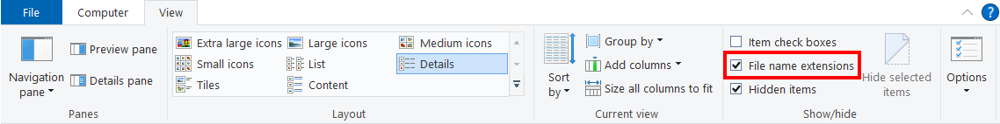
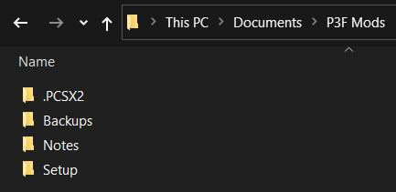
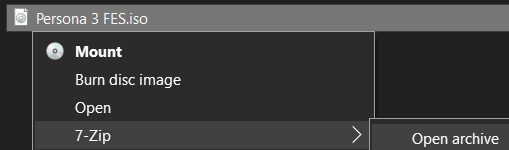
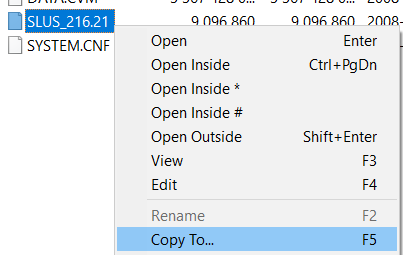
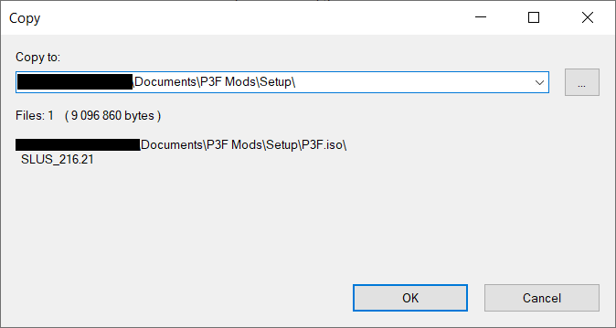
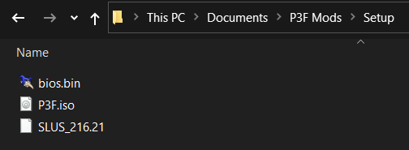

# Getting Started
## Required
### PC Stuff
- A registered installation of 64-bit Windows 10
  - The stable builds of PCSX2 for Mac and Linux have not been updated for 5+ years and I have no way of testing them.
  - Windows 7 support will be dropped in future releases of PCSX2 (also it's like 12 years old now).  
- An Internet connection during setup
- At least 1.5 GB of free space on your hard drive

### Game Files
- A North American PlayStation 2 BIOS file (.bin)
- A North American (NTSC-U) retail disc image of Persona 3 FES (.iso)
  - **Must** match this MD5: [4b16317a11f3089090748b7eca2acbaf](http://redump.org/disc/4125/)
  - The PAL and JP versions of P3F will not work, nor will any version of vanilla Persona 3.

## Recommended
- A CPU with at least **3 logical cores/threads** that scores at least **1600** on [PassMark Single Thread](https://www.cpubenchmark.net/singleThread.html)
- A dedicated graphics card with support for DirectX 11
  - If your graphics card was made in the last 10 years or so, it supports DirectX 11.
- A [supported controller](https://github.com/Pixelguin/P3F-CEP-docs/blob/main/docs/faq.md#what-controllers-does-pcsx2-support)

> P3F runs very well in an emulator, even on low-end hardware, but PCSX2 cannot perform miracles. If your PC is very old or has very weak specs, you may not be able to run the game at full speed.

## Show File Extensions
By default, Windows Explorer hides the extensions (.EXE, .PNG, etc.) of many file types. It's important that these be visible when setting up mods or asking for support, so we will make sure Windows always shows file extensions for all file types.

- Open **Windows Explorer** (the Windows file manager that you use to view Computer, Documents, etc.).
- Click the **View** tab at the top of the window.
- Check the box labelled **File name extensions** if it is not checked already.

## Delete Beta P3F CEP Installation
> If this is your first time installing P3F CEP, skip this step.

We will be starting from scratch with this version of P3F CEP.

- Open your old `P3F CEP` folder and back up your `bios`, `iso`, and `memcards` folders.
- ***Delete*** your old `P3F CEP` folder.
- ***Delete*** your old `Aemulus Package Manager` folder (unless you're using it for another Persona game).
 
## Install Prerequisites
Download and install the following:

- [7-Zip for 64-bit Windows x64](https://www.7-zip.org/download.html)
- [Visual C++ 2015-2019 Runtime (x86)](https://aka.ms/vs/16/release/VC_redist.x86.exe)
- [.NET Core 3.1.0 Runtime (x64)](https://download.visualstudio.microsoft.com/download/pr/9845b4b0-fb52-48b6-83cf-4c431558c29b/41025de7a76639eeff102410e7015214/dotnet-runtime-3.1.10-win-x64.exe)

> If you have installed or upgraded either P3F CEP or P4G CEP recently, you already have the runtimes installed.

## Download P3F CEP

Download the latest version of P3F CEP now if you haven't already.

- [Download from **GameBanana**](https://gamebanana.com/gamefiles/14827)

## Set Up P3F Mods Folder
We will use a dedicated folder named `P3F Mods` for everything related to P3F modding. It will contain the PCSX2 emulator needed to play P3F on your computer. If you ever need to create a file backup or write down a note, save it in this folder to stay organized.

- Unzip your P3F CEP download and locate the `P3F Mods` folder.
- Move the `P3F Mods` folder to your account's `Documents` directory.

> Make sure you're using your user account's `Documents` directory and not your `OneDrive\Documents` directory.

## Initial Setup
We're going to use a folder named `Setup` to temporarily store our game files as we get everything ready.

- Rename your Persona 3 FES disc image to **P3F.iso** and place it in your `P3F Mods\Setup` folder.
- Rename your PS2 BIOS to **bios.bin** and place it in your `P3F Mods\Setup` folder.

## Extract SLUS_216.21.elf
PS2 disc images use executable files called ELFs. In order to mod the game without permanently altering the ISO, we need to extract the ELF file from P3F.

- Right-click **P3F.iso** and select **7-Zip > Open archive** to open it in *7-Zip File Manager*.

- There should be a file in the 7-Zip window named **SLUS_216.21**. Right-click it and select **Copy To...**.

> If you can't find a file named **SLUS_216.21** *exactly*, you don't have the correct disc image and P3F CEP will not work with it. You need a North American (NTSC-U) DVD of Persona 3 FES.

- Click **OK** to extract the executable to your `P3F Mods\Setup` folder.

- Rename the file to **SLUS_216.21.elf**.

> Windows will ask if you're sure you want to change the file extension. Select **Yes**.

Once you have **P3F.iso**, **bios.bin**, and **SLUS_216.21.elf**, you're ready to move onto setting up the PCSX2 emulator.

## Continue
### Next: [PCSX2 Setup](03_pcsx2_setup.md)
### [Extras](extras.md) // [**Troubleshooting**](troubleshooting.md) // [**FAQ**](faq.md)
