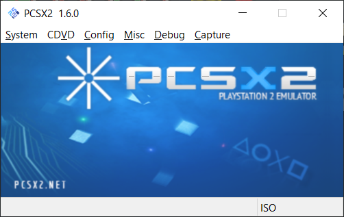

# Setting Up PCSX2

**PCSX2** is a free, [open-source](https://pcsx2.net/download/releases/source-code.html) emulator for playing PS2 games on a PC.

Using a PCSX2 feature called *hostFS*, we can load mods into the emulated game at runtime without altering the original ISO.

P3F CEP includes a copy of PCSX2 1.6 that is pre-configured for P3F, located in the `P3F Mods\.PCSX2` folder. All you need to do is supply a few files and set up your configuration.

## File Setup
- Move your **bios.bin** file from `P3F Mods\Setup` to the `P3F Mods\.PCSX2\bios` folder.
- Move your **P3F.iso** file from `P3F Mods\Setup` to the `P3F Mods\.PCSX2\iso` folder.
- Move your **SLUS_216.21.elf** file from `P3F Mods\Setup` to the `P3F Mods\.PCSX2\elf` folder.

> Now is a good time to make sure all of these files have the correct names! PCSX2 is configured to recognize these file paths *exactly*.

## PCSX2 Setup
- Open your `P3F Mods\PCSX2` folder and launch **PCSX2.exe**.

> If you get an error about missing a DLL file, you need to install the Visual C++ and .NET prerequisites mentioned in Getting Started.

## Test Run

We haven't installed any mods yet, but let's make sure PCSX2 can launch P3F before continuing.

- Select **System > Run ELF...** in the toolbar. Find and open **SLUS_216.21.elf** in the `P3F Mods\PCSX2\elf` folder to launch Persona 3 FES.
- Make sure PCSX2 can launch the game, play the opening cutscene, and show the title screen.

> If you get any errors, make sure all three of your files (BIN, ISO, ELF) are in the correct locations and named correctly. If you are still getting errors, you may need to redump your game disc or PS2 BIOS.

## Continue
### Next: [Aemulus Setup](04_aemulus_setup.md)
### [Extras](extras.md) // [**Troubleshooting**](troubleshooting.md) // [**FAQ**](faq.md)
