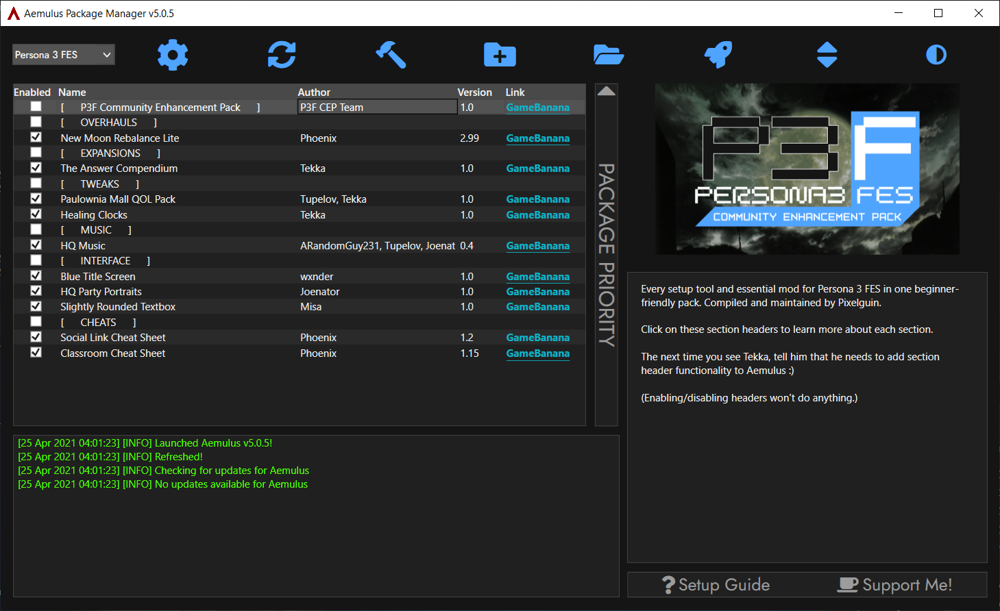
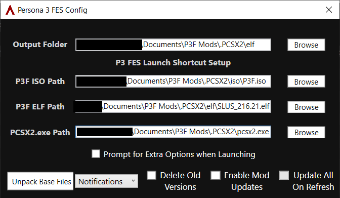
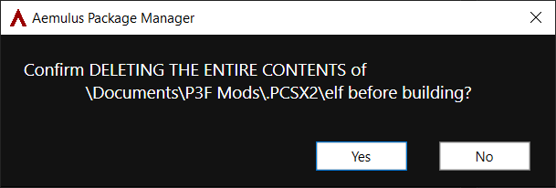

# Aemulus Setup
**Aemulus Package Manager** is an [open-source](https://github.com/TekkaGB/AemulusModManager) program that organizes, merges, and builds mod loadouts for Persona games.

> P3F CEP does not use the *Mod Compendium* program. Aemulus is capable of importing and converting Mod Compendium mods; see the [Extras](extras.md) section for more information.

## Information

The big list in the Aemulus window is called the **grid**.

Each individual entry on the grid is a **package**, a collection of loose files that Aemulus needs to **build** before it becomes a working mod in P4G.

Aemulus merges all the packages you have enabled into one set of files and saves them to your `P3F Mods\.PCSX2\elf` folder. The hostFS loader in PCSX2 then uses that folder to swap in modded files when you launch the game.

## Set Up Aemulus Folder
Since you might want to use Aemulus for other Persona games, we are going to put it in a separate folder called `Aemulus`.

> P4G CEP will support this unified `Aemulus` folder in a future 6.0 release. For now, if you are using P4G CEP, continue to use the Aemulus folder in `P4G Mods` for P4G.

- In your P3F CEP download, locate the `Aemulus` folder.
- Move the `Aemulus` folder to your account's `Documents` directory.

> Make sure you're using your user account's `Documents` directory and not your `OneDrive\Documents` directory.

## Initial Configuration
Aemulus needs a bit of setup before we can dive into customization.

### Open Config Window
- Open your `Documents\Aemulus` folder.
- Launch **AemulusPackageManager.exe**.
- If Aemulus asks you to update, select **Yes** to automatically update the program.
- Click the box in the top-left and select *Persona 3 FES*.
- Click the ⚙️ **Config** button to open the *Config* window.

### Set File Paths
Aemulus needs to know the location of several game files and folders in order to function.

 - Click **Browse** to the right of each box in the *Config* window and select the following files/folders:
    - *Output Folder:* `P3F Mods\.PCSX2\elf` folder
	- *P3F ISO Path:* `P3F Mods\.PCSX2\iso\P3F.iso`
    - *P3F ELF Path:* `P3F Mods\.PCSX2\elf\SLUS_216.21.elf`
    - *PCSX2.exe Path:* `P3F Mods\.PCSX2\PCSX2.exe`

### Unpack Base Files
Aemulus needs to unpack the archives from the P3F disc image into a folder named `Original` so it can merge packages together.

- Click **Unpack Base Files** and wait for the process to finish.
- Click **OK** to close the *Finished Unpacking!* window, then close the *Config* window.

## Customize Your Loadout
Now for the fun part! Choose which mods you'd like to use in P3F.

### Enabling/Disabling Packages

- Click on a package to get more information about it on the right side of the grid.
- To **enable** a package, check its box in the grid.
- To **disable** a package, uncheck its box in the grid.

> If you'd like to add your own mods that aren't part of P3F CEP, refer to the **Extras** section.

## Build Your Loadout
Aemulus needs to build your loadout in the `P3F Mods\.PCSX2\elf` folder once you've finished customizing it.

> Once you start building, Aemulus will delete ***everything except SLUS_216.21.elf*** in the output folder you defined in Config, **even personal files**. Make sure you  don't have any important files there before continuing.

 - Click the 🔨 **Build** button once you're ready.
 - Aemulus will ask you to confirm that you want to delete the entire contents of the output folder. Make sure the folder in the confirmation box is your `P3F Mods\PCSX2\elf` folder and click **Yes** to confirm.

 - Aemulus will begin merging packages and copying files. The process may take a few minutes.

## All finished! Let's play P3F!
Once Aemulus finishes building, you're ready to play!

- Click **OK** to close the *Finished Building!* window.
- Click 🚀 **Launch Persona 3 FES** to call PCSX2 and launch P3F.

## Important Gameplay Tips

- Using a keyboard? [Here are the default controls.](https://github.com/Pixelguin/P3F-CEP-docs/blob/main/docs/faq.md#what-are-the-default-keyboard-controls)
- Using a PlayStation or Nintendo controller? You'll need to [manually configure it](https://visihow.com/Configure_Controls_for_PCSX2_PlayStation_Emulator).
- Press **Alt + Enter** to enter fullscreen mode.
- Save the game often and on multiple save slots. I recommend saving every night or every other night at the very least.

## Continue
Head over to the [**Extras**](extras.md) section for instructions on:
- Adding custom packages to Aemulus
- Installing the Rebirth Cutscenes add-on
- Configuring graphics and input settings (Coming soon)

### [Extras](extras.md) // [**Troubleshooting**](troubleshooting.md) // [**FAQ**](faq.md)
