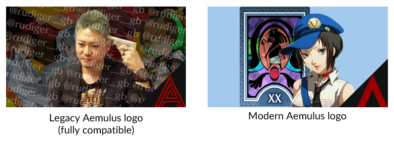
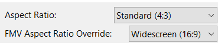

# Extras
## Add Custom Packages to Aemulus

### Compatibility
Most **Aemulus-compatible** mods will work with P3F CEP.

Look for the Aemulus logo in the bottom-right corner:

Aemulus will also automatically convert any package created for the **Mod Compendium** program.

### Tips

- A package with higher priority in Aemulus will override packages with lower priority in the event of a file conflict that can't be merged.
- A mod labelled **Work in Progress** (traffic cone on GameBanana) is incomplete and will have unexpected behavior.

### Installing New Mods

#### Download Packages
Aemulus 5.0+ supports **one-click mod installation** from GameBanana.

- Find the mod you want to download on GameBanana and select the **1-Click Install** button.

- Aemulus will automatically open. Follow the program's instructions to automatically download the package to your `Aemulus` folder.

#### Organize and Enable
- You can drag packages in Aemulus to organize them and change their build priority.
- Once you've decided on a position, **enable** the package by checking its box.
- Make sure to click 🔨 **Build**  when you're all done!

## Install Rebirth Cutscenes
**Rebirth Cutscenes** is a mod by Robot_Gerbil that replaces most of the FMV cutscenes in The Journey with scenes from the Persona 3 anime movies.

Since the cutscene files use a widescreen aspect ratio, the mod does not support 1-click installation and you will need to follow special instructions to install it.

### Download Mod

- Download Rebirth Cutscenes from [GameBanana](https://gamebanana.com/mods/download/50323).
- Unzip the download with 7-Zip.

### Set Up PCSX2
PCSX2 needs to be configured to support widescreen cutscenes.

- Locate the file **94A82AAA_RebirthCutscenes.pnach** and move it to your `P3F Mods\.PCSX2\cheats` folder.
- Launch PCSX2 and select **Config > Video (GS) > Window Settings...** in the toolbar.
- Set **FMV Aspect Ratio Override** to **Widescreen (16:9)**.

- Click **OK**, then close PCSX2.

> You will need to remove the PNACH file from the `cheats` folder and change this setting back to **Off (Default)** if you want to stop using Rebirth Cutscenes.

### Add and Build Package

- Launch Aemulus and make sure the box in the top-left corner says **Persona 3 FES**.
- In your Rebirth Cutscenes download, locate the `Rebirth Cutscenes` folder.
- Drag and drop the `Rebirth Cutscenes` folder onto the **Add Package** button in the Aemulus window.

- The **Rebirth Cutscenes** package should now be in your Aemulus window. Enable it and rebuild your loadout.