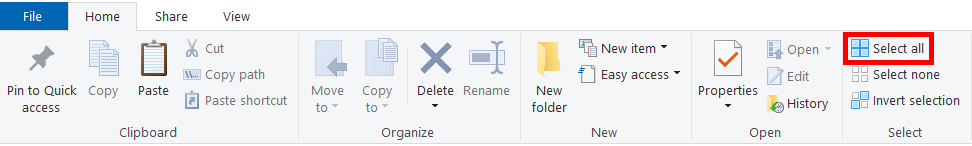

# Upgrade Instructions

> To upgrade from a version older than 1.0, follow the directions in [Getting Started](https://github.com/Pixelguin/P3F-CEP-docs/blob/master/docs/02_getting_started.md).

## Download Version 1.0.1 Upgrade

Download the **Version 1.0 to 1.0.1 Upgrade** package for P3F CEP now if you haven't already.

- [Download from **GameBanana**](https://gamebanana.com/mods/50322)

## Upgrade to Version 1.0.1

### Upgrade Packages

- Unzip the Upgrade download and open the **Aemulus Packages** folder inside.
- Click **Select all** in Windows Explorer to select all the packages in the folder.

- Drag and drop the package onto the **Add Package** icon in Aemulus. Aemulus will automatically upgrade your packages without touching anything else.

### Upgrade Backup File

- Open your `P3F Mods\Backups\Aemulus` folder.
- Replace the **Persona3FESPackages.xml** file here with the one in the Upgrade download.

### Upgrade Aemulus and Rebuild Packages

- Launch Aemulus. If it prompts you to download an update, select **Yes** and follow the instructions.
- Click 🔨 **Build** to upgrade your package loadout.
- You're all done! Enjoy your newly upgraded mod loadout!